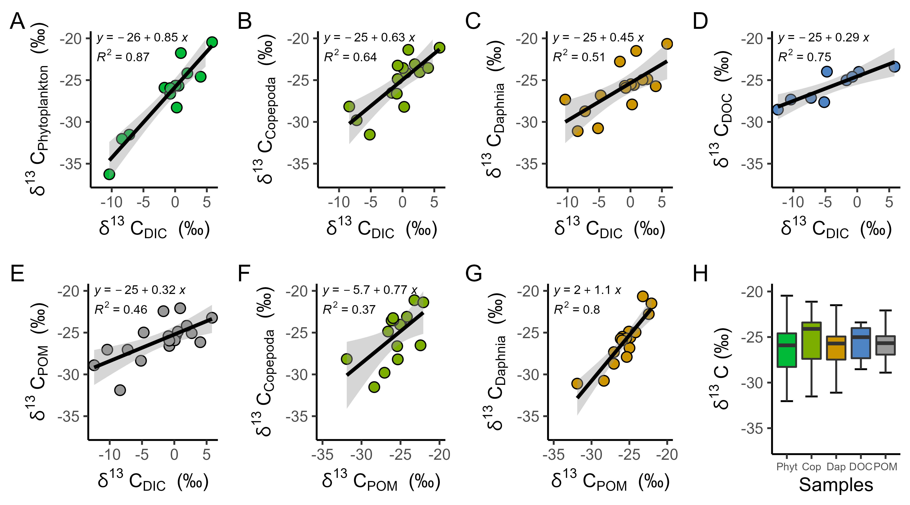

```{r setup, include=FALSE}
knitr::opts_chunk$set(echo = TRUE)
```

# Junna Wang
***
## PhD
[UC Davis](https://www.ucdavis.edu/) in *Ecology*


> blockquote; the meaning of blockquote?

***
## Master

<br>
***
## Undergraduate

R markdown allows to easily format your text. You can add [links](www.r-graph-gallery.com), write in **bold** or *italic*. This is very well explained in the [Rstudio cheatsheet](https://www.rstudio.com/wp-content/uploads/2015/02/rmarkdown-cheatsheet.pdf).


This is an R Markdown document. Markdown is a simple formatting syntax for authoring HTML, PDF, and MS Word documents. For more details on using R Markdown see <http://rmarkdown.rstudio.com>.

When you click the **Knit** button a document will be generated that includes both content as well as the output of any embedded R code chunks within the document. You can embed an R code chunk like this:

`a <- 2+2`



```{r}
b <- 2 + 3


```


